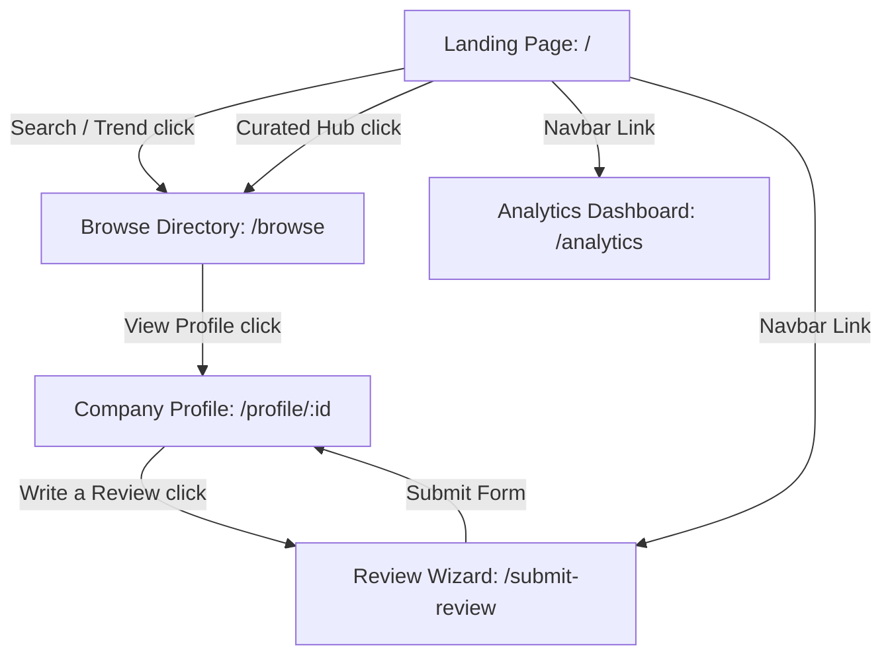

# Application Flow Documentation: InternPulse

This document provides a comprehensive operational guide detailing how the pages of **InternPulse** function, how users transition across views, and how data flows reactively between components.

---

## 1. Application Navigation Map

The application uses standard front-end routing mapped across five key modules. Below is a detailed flowchart of the user transition paths:



---

## 2. Interactive Page Walkthroughs

### 2.1 Landing Page (`Home.jsx`)
- **Search Engine**: Users enter queries in the search box. Clicking `[SEARCH DATA]` or pressing Enter gathers the input value and redirects the user to `/browse?q={query}`.
- **Trending Queries**: Direct click navigation shortcuts. Clicking `Quant Research`, `Product Design`, or `AI Ethics` redirects immediately to search results using those specific keywords.
- **Intelligence Hub Curation Cards**:
  - *Top Rated Card*: Directs to `/browse?filter=rating` displaying highly rated programs.
  - *High Stipend Card*: Renders deep dark contrast backgrounds and directs to `/browse?filter=stipend`.
  - *Remote Friendly Card*: Displays global markers and directs to `/browse?filter=remote`.
- **Methodology & Partnership Grid**: Static trust indicators representing partnership data (MIT, Stanford, etc.) and verification details. Includes an automated pulsing ring badge simulating active, real-time platform updates.

---

### 2.2 Browse Directory (`Browse.jsx`)
A highly responsive searching and filtering center. All actions occur inside the component without page reloads, utilizing React state synchronization.

1.  **Sidebar Filters**:
    *   *Clear all button*: Restores checkboxes to default (Technology: `true`, all others: `false`), range slider to `$5,000+`, location input to `""`, and sorting back to `"Pulse Score"`.
    *   *Industry Checklist*: Toggling checkboxes (Technology, Finance, Consulting, Media) filters the list. When active, it scans companies' primary categories.
    *   *Monthly Stipend Slider*: Sliding to values (e.g. `$3,500`) filters out all companies whose average stipend exceeds the selection. The active indicator renders values in real-time.
    *   *Location Search*: Autocomplete text input filtering results by matching location names.
    *   *Pulse Score buttons*: Triggers standard filter metrics (e.g. clicking `4.5+` instantly displays only companies with ratings at or above that threshold).
2.  **Sort Dropdown**: Toggling between `Pulse Score` and `Avg. Stipend` re-orders results instantaneously.
3.  **Result Cards**: Renders styled initials avatars, dynamic HSL capsules, numeric metrics (Pulse Score, stipend, location), and includes `[VIEW PROFILE]` links routing to specific company pages (e.g., `/profile/stripe`).
4.  **Pagination Controls**: Renders pages with active states. Clicking them navigates through lists (simulated directory sizes).

---

### 2.3 Salaries & Analytics Dashboard (`Analytics.jsx`)
An analytics engine aggregating market indicators and geo-intelligence.

- **Hotspots Vector Map**:
  - *Toggle Buttons*: Switch between `Global` (renders all hotspots) and `US Only` (filters out London, Singapore, and Bengaluru).
  - *Hotspot Pins*: Positioned dynamically on the styled world SVG path. Hovering over a pulsing pin opens an absolute tooltip displaying hub details and active counts.
- **Market Health Panel**: Calculates health scores based on review activities. Shows progress bar fills and links to reports.
- **Industry Leaders Checklist**: Renders top-paying sectors alongside download links.
- **Stipend Area Chart**: Powered by Recharts. Hovering over the custom spline curve opens a hover indicator showing the average stipend calculated for that specific month, complete with light-themed styling overlays.
- **Satisfaction index bar charts**: Renders comparative progress bars. The current year's score fills with emerald HSL color, laid over the gray comparative baseline representing last year's averages.

---

### 2.4 Company Profile Dashboard (`Profile.jsx`)
Provides structured analytics for a single organization.

1.  **Company Identity Panel**: Displays logo avatars matching companies' unique colors, primary tags, and overall Pulse scores.
2.  **Hero CTAs**:
    *   `[Write a Review]`: Routes users to `/submit-review?company={id}` to pre-fill the company name.
    *   `[Save Company]` & `[Compare Stats]`: Quick micro-actions.
3.  **Metrics Deck**: Renders four prominent cards detailing stipend tiers, weekly hours, offer conversion, and verified review counts.
4.  **Culture Stats Grid**: Renders horizontal scores for Supportiveness, Autonomy, Learning, and Balance.
5.  **Smart Editor insights**: Outputs specific mentoring text highlights depending on which company page is loaded.
6.  **Timeline Feed**: Displays verified review cards with avatar details, Pros/Cons columns, and specific technical tag labels.
7.  **Comparison Sidebar Widget**: Renders peer competitors. Clicking a competitor (e.g., Anthropic) immediately re-routes the user to `/profile/anthropic`, updating the entire page state dynamically.
8.  **Vite Rating Pulse**: Displays a 12-month bar chart using Recharts mapping rating histories.

---

### 2.5 Review submission Wizard (`ReviewWizard.jsx`)
A highly optimized 3-stage form wizard.

*   **Step 1: The Basics**
    *   Users fill in the position and monthly stipend.
    *   *Autocomplete lookup*: Typing in the "Company Name" scans existing databases. Selecting a suggestion fills the input. If the user types a new company, the state engine registers the new company upon submission.
    *   Clicking `[Continue ->]` validates fields. If complete, it triggers a slide transition to the next step.
*   **Step 2: Culture & Feedback**
    *   Users select a rating (1 to 5 stars) using dynamic star buttons.
    *   Users describe Pros and Cons in textareas and select applicable skill tags.
*   **Step 3: Verification**
    *   Inputs professional or university emails to confirm review authenticity.
    *   Clicking `[Submit Review]` saves the review, recalculates metrics, and redirects the user to the company page.

---

## 3. Dynamic Data Sync Flow Tracing

When an intern submits a review, the application processes the data in real-time through the following front-end lifecycle:

```mermaid
sequenceDiagram
    participant U as User
    participant W as ReviewWizard Page
    participant S as StoreContext Engine
    participant L as LocalStorage
    participant P as Profile Page

    U->>W: Step 1: Input basics & Company Name
    U->>W: Step 2: Choose rating, input Pros/Cons
    U->>W: Step 3: Enter email & Click Submit
    W->>S: Calls registerNewCompany(name) & addReview(companyId, review)
    activate S
    S->>S: Generate unique review ID & fetch current date
    S->>S: Recalculate average stipend & overall rating
    S->>S: Randomize culture sub-scores slightly (+/- 2%)
    S->>S: Increment market health metrics
    S->>L: Save updated companies list to LocalStorage
    deactivate S
    S-->>W: Returns success confirmation
    W->>P: Navigates automatically to /profile/{companyId}
    activate P
    P->>L: Fetch newly updated company stats & reviews
    P-->>U: Renders new metrics cards, charts, and review card
    deactivate P

    Everything isnt working for now bye now it will work
```

