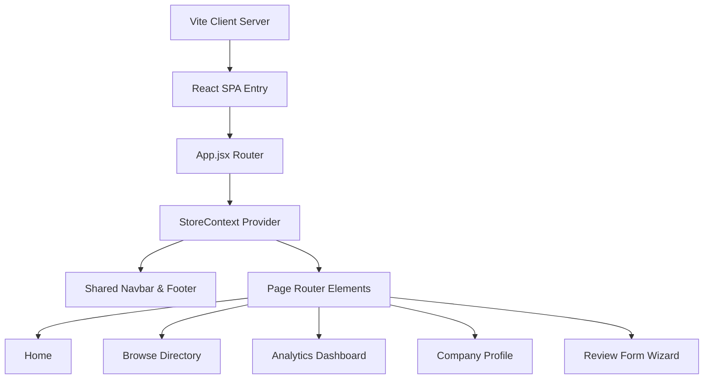

# Technical Requirements Document (TRD): InternPulse

This Technical Requirements Document (TRD) outlines the architectural layout, component hierarchy, state engine specifications, data design, and styling tokens for the **InternPulse** web application.

---

## 1. System Architecture Overview

InternPulse is structured as a client-side, highly interactive Single Page Application (SPA) built using **React** and powered by **Vite**. The design focuses on high performance, local persistence, premium visual rendering (using Recharts and custom inline vector SVGs), and modular custom styling.makung it but it will take a lot of time yet.



### Key Technical Characteristics:
- **Framework**: React 18+ (scaffolded via Vite template).
- **Router**: `react-router-dom` (BrowserRouter) for seamless history navigation and query parameters integration.
- **State Management**: React Context API (`StoreContext.jsx`) synchronizing all lists and triggers in real-time.
- **Persistence Layer**: LocalStorage syncing for all mock database modifications.
- **Styling**: Pure Vanilla CSS (`src/index.css`) complete with CSS variables and media query responsive blocks.
- **Iconography**: Vector SVG icons provided by `lucide-react`.
- **Data Visualizations**: Built using `recharts` for charts and custom embedded SVG tags for geographic hotspots.

---

## 2. Directory Structure

The codebase maintains a standard React hierarchy:

```text
e:/Intern  rating portal/
├── dist/                     # Optimized production bundle
├── public/                   # Static assets (Vite logo, etc.)
├── src/
│   ├── assets/               # Vector images and media
│   ├── components/           # Shared, reusable UI widgets
│   │   ├── Navbar.jsx        # Navigation header
│   │   ├── Footer.jsx        # Platform footer
│   │   └── WorldMap.jsx      # Vector world hotspot visualizer
│   ├── context/
│   │   └── StoreContext.jsx  # Global state manager
│   ├── data/
│   │   └── mockData.js       # Pre-seeded database values
│   ├── pages/                # Screen view containers
│   │   ├── Home.jsx          # Landing page
│   │   ├── Browse.jsx        # Directory & search filters
│   │   ├── Analytics.jsx     # Salaries & saturation dashboard
│   │   ├── Profile.jsx       # Company profile detailed deck
│   │   └── ReviewWizard.jsx  # Multi-step submission form
│   ├── App.jsx               # Application shell & routes
│   ├── index.css             # Unified CSS tokens & styles
│   └── main.jsx              # React mounting entrypoint
├── eslint.config.js          # Code quality guidelines
├── package.json              # Script definitions & npm packages
├── prd.md                    # Product Requirements Document
└── vite.config.js            # Vite bundler configurations
```

---

## 3. Data Schema & Engine

The state engine operates on a local database schema defined in `src/data/mockData.js` and synced reactive-style through `src/context/StoreContext.jsx`.

### 3.1 Company Data Schema
```typescript
interface Company {
  id: string;                  // URL slug matching name (e.g. "stripe")
  name: string;                // Display name
  category: string;            // Primary sector (e.g. "Fintech")
  tags: string[];              // Visualization labels (e.g. ["FINTECH", "REMOTE FRIENDLY"])
  pulseScore: number;          // Aggregated rating (average of reviews rating)
  stipend: number;             // Average monthly stipend calculated from submissions
  stipendTier: string;         // Stipend contextual tag
  hours: number;               // Average weekly working hours
  hoursTier: string;           // Workload intensity description
  returnOfferRate: number;     // Return offer conversion rate
  returnOfferTier: string;     // Contextual offer tag
  satisfaction: number;        // Overall satisfaction score out of 5
  satisfactionCount: number;   // Total count of verified reviews
  supportiveness: number;      // Intern culture facet (0 - 100)
  autonomy: number;            // Intern culture facet (0 - 100)
  learningCurve: number;       // Intern culture facet (0 - 100)
  workLifeBalance: number;     // Intern culture facet (0 - 100)
  pulseInsight: string;        // Formatted editor highlight text
  location: string;            // Primary headquarters
  locations: string[];         // Active office locations list
  hiringStatus: string;        // Active hiring message
  deadline: string;            // Application deadline text
  website: string;             // Company external URL
  logoColor: string;           // Aesthetic hex color for avatar rendering
  peers: string[];             // Related company IDs for peer comparisons
  monthlyRatingPulse: number[];// 12-month array of ratings for the profile chart
  reviews: Review[];           // List of user review submissions
}
```

### 3.2 Review Submission Schema
```typescript
interface Review {
  id: string;                  // Unique review ID (e.g. "stripe-r1")
  role: string;                // Specific position title
  term: string;                // Semester duration (e.g. "Summer 2024")
  verified: boolean;           // Email verification status
  rating: number;              // User rating (1.0 to 5.0)
  pros: string;                // Description of positives
  cons: string;                // Description of negatives
  tags: string[];              // Skill or perk tags selected by user
  date: string;                // Formatted submission date string
}
```

### 3.3 State Operations in Context
- **Initialization**: Automatically reads `"internpulse_companies"` from LocalStorage. If empty, imports `INITIAL_COMPANIES` from mock data.
- **`addReview(companyId, review)`**:
  *   Inserts review payload to targeted company's `reviews` array.
  *   Re-calculates `pulseScore` and `satisfaction` by averaging ratings.
  *   Re-calculates `stipend` by incorporating new stipend numeric input.
  *   Randomizes culture scores (+/- 2%) to represent interactive feedback.
  *   Increments overall `marketHealthScore` slightly to represent active submission engagement.
  *   Saves the resulting array back to LocalStorage.
- **`registerNewCompany(name, category)`**:
  *   Converts custom name to a lower-case hyphenated slug ID.
  *   Checks for duplicates.
  *   If unique, scaffolds a new `Company` schema filled with standard baseline statistics, allowing the user to review newly registered firms instantly.

---

## 4. UI Design System (CSS System)

Styling uses a custom design tokens setup written in pure Vanilla CSS at `src/index.css`.

### 4.1 Custom Property Token Registry
```css
:root {
  /* Color Palette matching Stich aesthetic */
  --bg-primary: #f8fafc;
  --bg-secondary: #ffffff;
  --bg-dark: #0f172a;
  --bg-dark-hover: #1e293b;
  
  --text-primary: #0f172a;
  --text-secondary: #475569;
  --text-muted: #94a3b8;
  --text-white: #ffffff;
  
  --brand-primary: #10b981;    /* Vibrant emerald for green accents */
  --brand-secondary: #059669;  /* Darker emerald for active buttons */
  --brand-accent: #3b82f6;     /* Sleek blue for highlight capsules */
  --brand-light-green: #e6fbf4; /* Soft green backgrounds */
  --brand-light-blue: #eff6ff;  /* Soft blue backgrounds */
  
  --border-color: #f1f5f9;
  --border-heavy: #cbd5e1;
  --border-dark: #334155;
  
  /* Typography Scale */
  --font-sans: 'Inter', sans-serif;
  --font-display: 'Outfit', sans-serif;
  
  /* Radii */
  --radius-sm: 6px;
  --radius-md: 12px;
  --radius-lg: 18px;
  --radius-full: 9999px;
}
```

### 4.2 Key Interactive Animations
- **Map Pulsing pins**: Continual ripple effect using CSS `@keyframes rippleEffect` translating outer boundary radii:
  ```css
  @keyframes rippleEffect {
    0% { r: 4px; opacity: 0.8; }
    100% { r: 20px; opacity: 0; }
  }
  ```
- **Form Wizard steps**: Fluid slide and opacity transitions using CSS `@keyframes fadeTransition` when changing steps:
  ```css
  @keyframes fadeTransition {
    from { opacity: 0; transform: translateY(6px); }
    to { opacity: 1; transform: translateY(0); }
  }
  ```

---

## 5. Third-Party Integrations & Charting

### 5.1 Recharts Layout Settings
Recharts is utilized on the Analytics and Profile pages, compiling inside Vite using custom ESModules:
- **Responsive Wrappers**: wrapped in `<ResponsiveContainer width="100%" height={240}>` to ensure liquid grid scaling.
- **Grading Color Defs**: Gradient areas defined on the Canvas using SVG `<defs>` inside the `<AreaChart>` tags to display glowing brand fills under curves.
- **Custom Tooltips**: Styled utilizing standard index CSS properties to override standard browser shapes and match the light theme visual style.

### 5.2 Hotspot Mapping Logic
- Rather than loading massive, laggy geographical libraries (Mapbox, Google Maps), geography is represented as a high-fidelity inline vector map in `src/components/WorldMap.jsx`.
- Pre-projected continent paths are rendered inside an SVG `viewBox="0 0 1000 500"`.
- Glowing coordinates are mapped utilizing layout percentages:
  - San Francisco: `x: 18%, y: 38%`
  - New York: `x: 26%, y: 36%`
  - London: `x: 47%, y: 28%`
  - Singapore: `x: 78%, y: 64%`
  - Bengaluru: `x: 70%, y: 52%`
- Coordinates are plotted as absolute position elements inside the responsive container, rendering immediate localized details on mouse hover.
